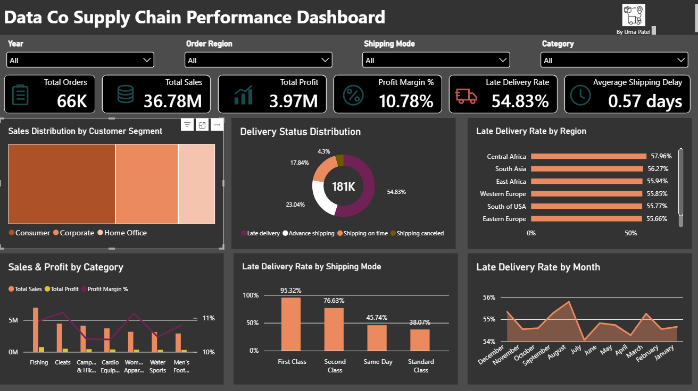

# Supply Chain Performance Analytics

An end-to-end supply chain analytics project focused on evaluating **sales, profitability, shipping performance, and delivery efficiency** using Python and Power BI.

## Project Overview

This project analyzes **180K+ supply chain records** to explore business and operational performance across orders, products, customers, and shipping activities.

The project involved data cleaning and transformation, exploratory analysis, supply chain performance analysis, data modeling, KPI development, and interactive dashboard design.

## Dashboard Preview

The dashboard provides an interactive view of key business and supply chain metrics, including sales, profitability, shipping performance, and delivery patterns.

## Tools & Technologies

- **Python:** Pandas
- **Power BI:** Data Modeling, DAX, KPI Reporting, Interactive Visualization
- **Excel:** Data Exploration and Validation

## Project Highlights

- Processed and analyzed **180K+ supply chain records**
- Evaluated **sales, profit, orders, and delivery performance**
- Analyzed **shipping patterns and late-delivery trends**
- Built and validated the underlying **data model and relationships**
- Developed **KPIs and performance metrics** for supply chain analysis
- Designed a **single-page interactive Power BI dashboard** for performance monitoring

## Dataset

This project uses the **DataCo Smart Supply Chain for Big Data Analysis** dataset available on Kaggle.

**Source:** [Download the dataset from Kaggle](https://www.kaggle.com/datasets/shashwatwork/dataco-smart-supply-chain-for-big-data-analysis)

The raw dataset is not included in this repository. Please refer to the original Kaggle source to access the data.

## Note

This project was developed for learning and portfolio demonstration.
